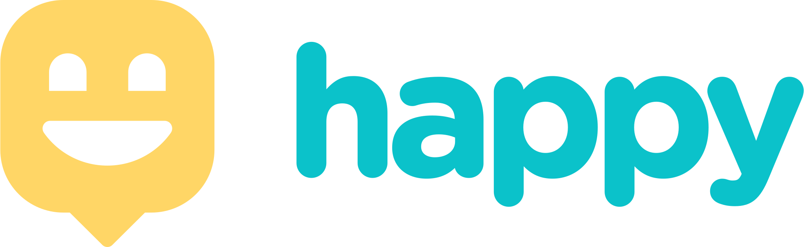

<h1 align="center">
    
</h1>

<p align="center">
  <a href="#-tecnologias">Tecnologias</a>&nbsp;&nbsp;&nbsp;|&nbsp;&nbsp;&nbsp;
  <a href="#-projeto">Projeto</a>&nbsp;&nbsp;&nbsp;|&nbsp;&nbsp;&nbsp;
  <a href="#memo-licença">Licença</a>
</p>

<p align="center">
 

  
</p>

<br>

<p align="center">
  
</p>

## 🚀 Tecnologias

Esse projeto foi desenvolvido com as seguintes tecnologias:

- [Node.js](https://nodejs.org/en/)
- [React](https://reactjs.org)
- [React Native](https://facebook.github.io/react-native/)
- [Expo](https://expo.io/)
- [TypeScript](https://www.typescriptlang.org/)

## 💻 Projeto

O Happy é uma aplicação que conecta pessoas à casas de acolhimento institucional para fazer o dia de muitas crianças mais feliz 💜

## 🌐Install Web dependencies

```sh
yarn --cwd ./web install
```

## 🚀Usage

```sh
yarn --cwd ./web dev
```

## 📃Install Backend dependencies

```sh
yarn --cwd ./backend install
```

## 🗄️Database migration

```sh
yarn --cwd ./backend migration:run
```

## 🚀Serve Backend

```sh
yarn --cwd ./backend dev
```

## 📲Install Mobile dependencies

```sh
yarn --cwd ./mobile install
```

## 🚀Start Mobile

```sh
yarn --cwd ./mobile start
```

## :memo: Licença

Esse projeto está sob a licença MIT. Veja o arquivo [LICENSE](LICENSE.md) para mais detalhes.

---

Feito com ♥ by Paulo J. Raitz junto à Rocketseat :wave: Até a proxima!
